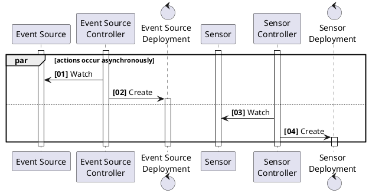
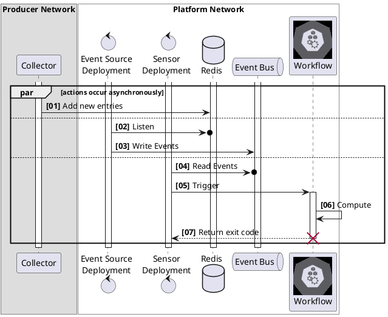

# Sequence Diagrams

## Deployment

```puml
@startuml
!include <kubernetes/k8s-sprites-unlabeled-25pct>

autonumber "<b>[00]"

participant "Event Source" as es
participant "Event Source\nController" as esc
control "Event Source\nDeployment" as esd

participant "Sensor" as sensor
participant "Sensor\nController" as sensorc
control "Sensor\nDeployment" as sensord

activate es
activate esc
activate sensor
activate sensorc

par actions occur asynchronously
  esc -> es : Watch
  esc -> esd ++ : Create
else
  sensorc -> sensor : Watch
  sensorc -> sensord ++ : Create
end

deactivate es
deactivate esc
deactivate esd
deactivate sensor
deactivate sensorc
deactivate sensord

@enduml
```

## Ingestion

```puml
@startuml
!include <kubernetes/k8s-sprites-unlabeled-25pct>

autonumber "<b>[00]"

box "Producer Network"
participant "Collector" as publisher
end box

box "Platform Network" #White
control "Event Source\nDeployment" as esd
control "Sensor\nDeployment" as sensord

database "Redis" as redis
queue "Event Bus" as evbus
participant "<$node>\nWorkflow" as container
end box

activate esd
activate sensord

activate publisher
activate redis
activate evbus

par actions occur asynchronously
  publisher -> redis : Add new entries
else
  esd ->o redis : Listen
  esd -> evbus : Write Events
else
  sensord ->o evbus : Read Events
  sensord -> container ++ : Trigger
  container -> container : Compute
  container --> sensord : Return exit code
  destroy container
end

deactivate esd
deactivate sensord
deactivate publisher
deactivate redis
deactivate evbus

@enduml
```
