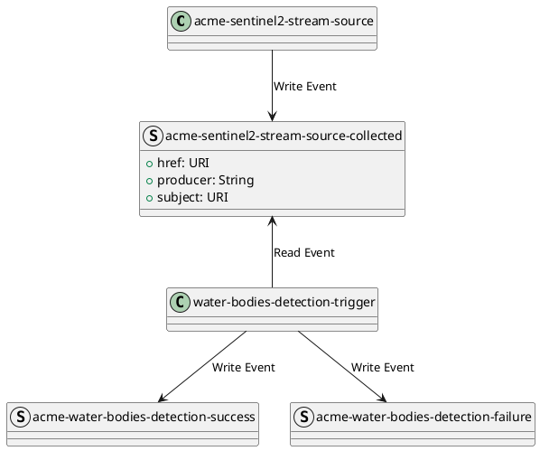

# Topics

```puml
@startuml

class "acme-sentinel2-stream-source" as StreamSource

struct "acme-sentinel2-stream-source-collected" as StreamSourceCollected {
  +href: URI
  +producer: String
  +subject: URI
}

class "water-bodies-detection-trigger" as WaterBodiesDetectionTrigger

struct "acme-water-bodies-detection-success" as WaterBodiesDetectionSuccess
struct "acme-water-bodies-detection-failure" as WaterBodiesDetectionFailure

StreamSource -d-> StreamSourceCollected : Write Event
WaterBodiesDetectionTrigger -u-> StreamSourceCollected : Read Event

WaterBodiesDetectionTrigger -d-> WaterBodiesDetectionSuccess : Write Event
WaterBodiesDetectionTrigger -d-> WaterBodiesDetectionFailure : Write Event

@enduml
```
